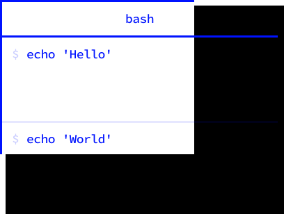
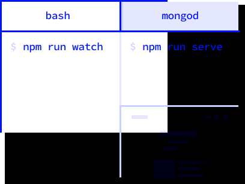
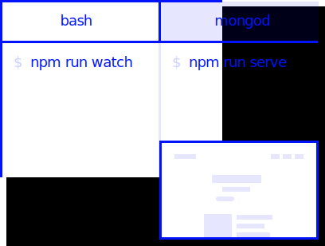
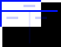

> Layout presets for [Hyper.app](https://hyper.is)


[](https://github.com/sindresorhus/xo)
## Install

```sh
$ npm install -g hyperlayout hpm-cli
$ hpm install hyperlayout
```

## Usage
To get started, setup a layout inside of `package.json`.

_Alternatively you can define it inside of `.hyperlayout` or `~/.hyperlayout`._

> `package.json`
```json
{
  "name": "example-1",
  "hyperlayout": [
    [
      "echo 'Hello'",
      "echo 'World'"
    ]
  ]
}
```

To apply the layout, simply run `hyperlayout` in the same directory.

```sh
$ hyperlayout
```
#### Result


---

### Advanced example
This example shows the capabilities of `hyperlayout`.

> `package.json`
```json
{
  "name": "example-2",
  "scripts": {
    "watch": "gulp watch",
    "serve": "nodemon build/index"
  },
  "hyperlayout": {
      "start": [
        [[
          "npm run watch",
          ["npm run serve", "http://localhost:3000"]
        ]],
        "mongod"
      ],
      "helloworld": {
        "entry": "horizontal",
        "layout": [
          "echo 'Hello'",
          "echo 'World'"
        ]
      }
  }
}
```

Since there are two layouts defined here, you have to tell `hyperlayout` which one you want to use, by suppling it as parameter.

```sh
$ hyperlayout start
```
#### Result


## Examples
 **Tabs**
```json
["1", "2"]
```
---
 **Horizontal Panes**
```json
[["1", "2"]]
```
or
```json
{
  "entry": "horizontal",
  "layout": ["1", "2"]
}
```
---
 **Vertical Panes**
```json
[[["1", "2"]]]
```
or
```json
{
  "entry": "vertical",
  "layout": ["1", "2"]
}
```

## License
`hyperlayout` was written by [Timo Lins](https://timo.sh).
