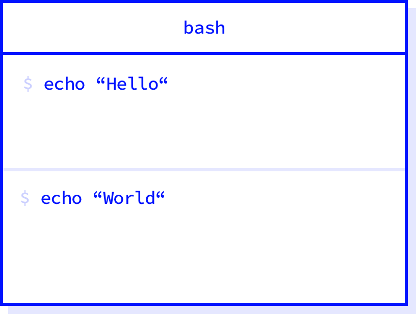
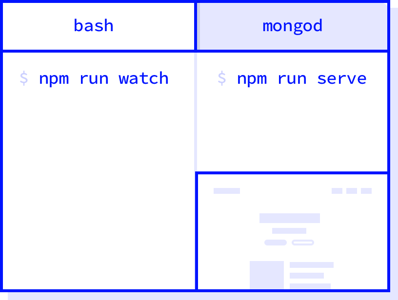

# hyperlayout
[](https://github.com/sindresorhus/xo)

Layout presets for Hyper.app

## Install

```sh
$ npm install -g hyperlayout hpm-cli
$ hpm install hyperlayout
```

## Usage

`package.json`
```json
{
  "name": "my-example",
  "scripts": {
    "watch": "gulp watch",
    "serve": "nodemon build/index"
  },
  "hyperlayout": [
    "echo 'Hello'",
    "echo 'World'"
  ]
}
```



`package.json`
```json
{
  "name": "my-example",
  "scripts": {
    "watch": "gulp watch",
    "serve": "nodemon build/index"
  },
  "hyperlayout": [
    [
      "npm run watch",
      ["npm run serve", "http://localhost:3000"]
    ],
    "mongod"
  ]
}
```

